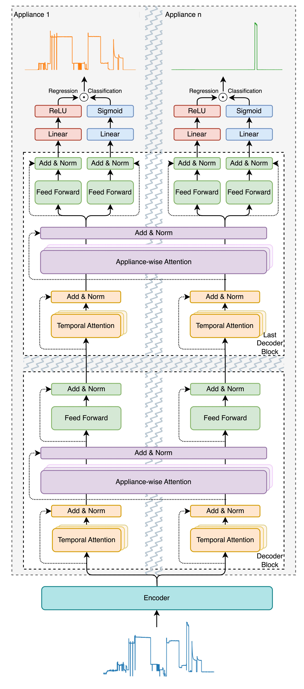

# MATNilm: Multi-appliance-task Non-intrusive Load Monitoring with Limited Labeled Data
Contact me with jxiong20@outlook.com.

## Introduction
The official code for paper
[[MATNilm: Multi-appliance-task Non-intrusive Load Monitoring with Limited Labeled Data](https://ieeexplore.ieee.org/document/10224774)]

<p align="center">
  
</p>

We propose a multi-appliance-task framework with a training-efficient sample augmentation (SA) scheme that boosts the disaggregation performance with limited labeled data. For each appliance, we develop a shared-hierarchical split structure for its regression and classification tasks. In addition, we also propose a two-dimensional attention mechanism in order to capture spatio-temporal correlations among all appliances. 
With only one-day training data and limited appliance operation profiles, the proposed SA algorithm can achieve comparable test performance to the case of training with the full dataset. Finally, simulation results show that our proposed approach features a significantly improved performance over many baseline models. The relative errors can be reduced by more than 50% on average.

## Usage
To reproduce the MAT-Conv on the REDD dataset, run the following command with data augmentation:
```
python main.py --dataAug
```


## License
**The project is only free for academic research purposes, but needs authorization for commerce. For commerce permission, please contact jxiong20@outlook.com.**

## Citation
If you use our code/model, please cite our [[paper](https://ieeexplore.ieee.org/document/10224774)].
